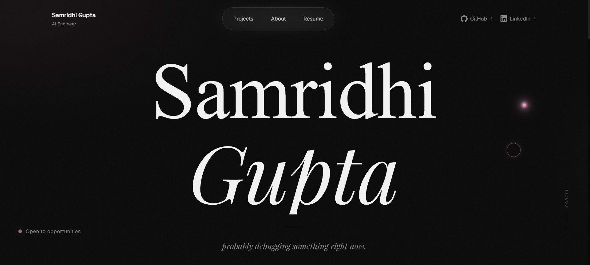
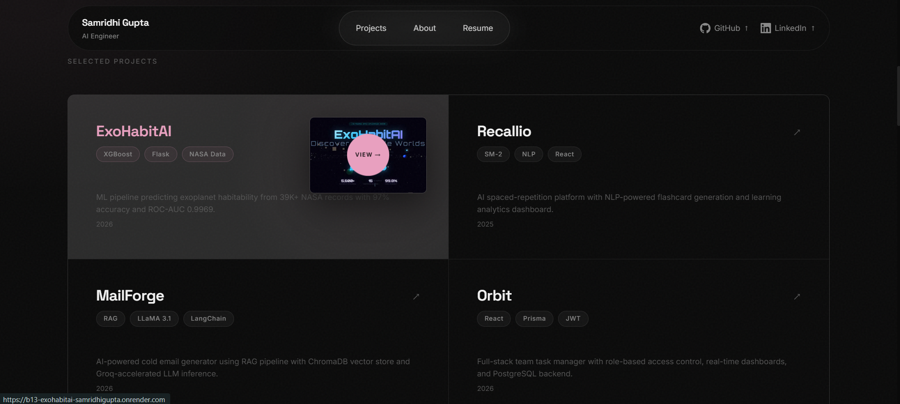
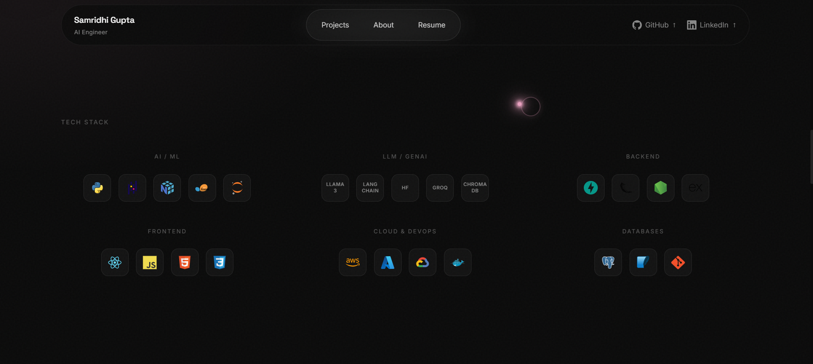
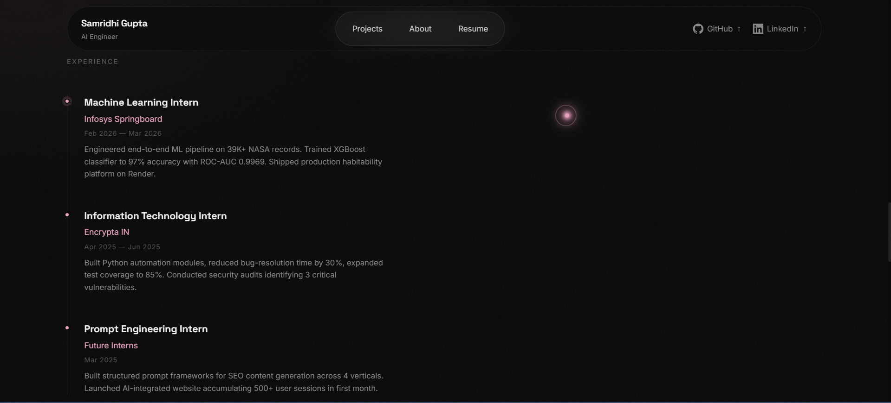
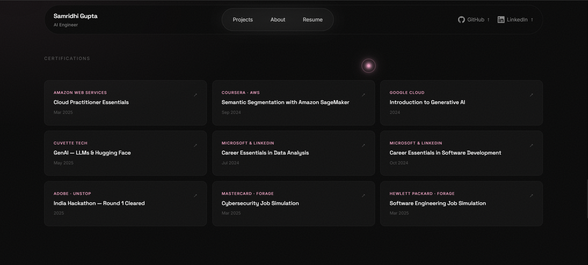
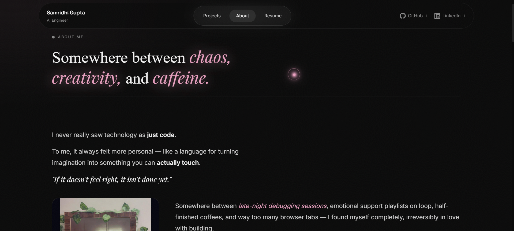

<div align="center">

<br />

# Samridhi Gupta

### *AI Engineer · probably debugging something right now.*

<br />

[](https://samridhiiigupta.netlify.app/)
[](https://github.com/SamridhiiiGupta)
[](https://www.linkedin.com/in/samridhiii-gupta/)

<br />


<br />

> *"where intelligence meets code"*

<br />

</div>

---

## 📌 Table of Contents

- [About This Project](#-about-this-project)
- [Live Demo](#-live-demo)
- [Screenshots](#-screenshots)
- [Features](#-features)
- [Tech Stack](#-tech-stack)
- [Project Architecture](#-project-architecture)
- [Setup & Run Locally](#-setup--run-locally)
- [Deployment](#-deployment)
- [Design Philosophy](#-design-philosophy)
- [Future Improvements](#-future-improvements)
- [Connect With Me](#-connect-with-me)

---

## 🧠 About This Project

This is my **personal developer portfolio** — a multi-page, hand-crafted website built entirely from scratch in vanilla HTML, CSS, and JavaScript. No templates. No page builders. No shortcuts.

It is a direct reflection of how I build: with **obsessive attention to detail**, a genuine love for aesthetics, and an engineer's mindset for making things that work beautifully.

The portfolio features a full editorial design language — from the letter-by-letter welcome animation, to the mouse-following spotlight on project cards, to the smooth inertia scroll powered by Lenis. Every detail was intentional.

> **Tagline:** *code. chaos. creativity.*

---

## 🌐 Live Demo

<div align="center">

### 👉 [samridhiiigupta.netlify.app](https://samridhiiigupta.netlify.app/)

*Click to explore the live experience — animations, interactions, and all.*

</div>

---

## 📸 Screenshots

<br />

### 🏠 Hero — Home Page



> The opening screen greets visitors with a full-screen welcome animation — each character of the name animates in letter-by-letter before dissolving into the main hero. The name is typeset in a bold serif/cursive mix with an editorial role label above and a status indicator below.

---

### 🚀 Selected Projects



> Four featured projects displayed in an asymmetric card grid. Each card features a live project preview image, tech stack tags, year label, and a mouse-following radial spotlight effect. Clicking navigates to the deployed project.

---

### 🛠️ Tech Stack



> A categorized icon grid spanning AI/ML, LLM/GenAI, Backend, Frontend, Cloud & DevOps, and Databases. Each icon has a custom tooltip that appears on hover. The section is preceded by a seamlessly looping infinite marquee of technologies.

---

### 📅 Experience & Certifications


<br>


> A clean vertical timeline showcasing internship roles with company, date, and description. Below it, a 3-column certification grid features 9 verified credentials from AWS, Google Cloud, Microsoft, Adobe, Mastercard, and Hewlett Packard — each linking directly to its certificate.

---

### 👤 About Page



> An editorial storytelling page that alternates between full-bleed imagery and personal narrative text. Features scroll-driven GSAP reveal animations, a dramatic closing statement, and a writing style that balances technical credibility with genuine personality.

---

## ✨ Features

### 🎬 Animations & Interactions

| Feature | Implementation |
|---|---|
| **Welcome Splash Screen** | Letter-by-letter character animation (`<span class="char">`) with staggered timing, dissolves out before revealing the page |
| **Custom Animated Cursor** | Fully custom cursor with unique behavior defined in `cursor.js` + `cursor.css`, replacing the browser default |
| **Hero Spotlight Orb** | A mouse-following ambient glow orb in the hero section that tracks cursor movement in real time |
| **Magnetic Navigation** | Nav links with a `data-magnetic` attribute respond to mouse proximity with a pull-toward effect |
| **Project Card Spotlight** | Each project card tracks `mousemove` via CSS custom properties (`--mouse-x`, `--mouse-y`) to create a radial spotlight that follows the cursor |
| **Lenis Smooth Scroll** | Buttery inertia-based scrolling powered by `@studio-freight/lenis` |
| **GSAP ScrollTrigger Reveals** | Elements fade and slide into view as the user scrolls, powered by GSAP 3 + ScrollTrigger |
| **Infinite Tech Marquee** | A duplicated, CSS-animated scrolling band of tech stack keywords runs continuously across the page |

### 🗂️ Pages & Sections

| Page | Sections |
|---|---|
| **Home (`index.html`)** | Welcome overlay · Navbar · Hero · Tech Marquee · Selected Projects · Tech Stack · Experience Timeline · Certifications · Footer |
| **About (`about.html`)** | Hero title · 4 alternating image+text story blocks · Closing statement |
| **Projects (`projects.html`)** | Full project showcase (7 total projects) |

### 🎨 UI/UX Highlights

- **Mixed typography system** — serif ("Samridhi") paired with italic cursive ("Gupta") for the hero name treatment
- **Status indicator** — a pulsing green dot with "Open to opportunities" label pinned to the hero section
- **Scroll indicator** — animated downward line with "Scroll" label guides first-time visitors
- **Tech tooltip system** — hover tooltips on all tech stack icons
- **Certification grid** — 9 real credentials with direct PDF/image links, each opening in a new tab
- **Fully responsive** — dedicated `responsive.css` handles all breakpoints
- **CDN preconnect optimization** — `<link rel="preconnect">` and `dns-prefetch` for Cloudflare and jsDelivr CDNs to reduce latency
- **Semantic HTML** — proper use of `<nav>`, `<main>`, `<section>`, `<footer>`, `aria-hidden`
- **Lazy-loaded project images** — `loading="lazy"` on all project preview images

---

## 🛠 Tech Stack

### Core

| Technology | Role |
|---|---|
| **HTML5** | Multi-page structure and semantic markup |
| **CSS3** | Custom variables, keyframe animations, grid/flexbox layouts, responsive breakpoints |
| **Vanilla JavaScript** | Interactivity, DOM manipulation, event handling, dynamic effects |

### Animation Libraries

| Library | Version | Role |
|---|---|---|
| **GSAP** | 3.12.5 | ScrollTrigger reveals, entrance animations, scroll-driven effects |
| **ScrollTrigger** | 3.12.5 | Scroll-aware animation triggers (GSAP plugin) |
| **Lenis** | 1.0.45 | Smooth inertia scroll |

### Hosting & Tooling

| Tool | Role |
|---|---|
| **Netlify** | Deployment and hosting |
| **GitHub** | Version control |
| **devicon CDN (jsDelivr)** | Tech stack icon SVGs |

---

## 📁 Project Architecture

```
Portfolio/
│
├── index.html               # Home page — Hero, Projects, Tech Stack, Experience, Certs
├── about.html               # About page — Editorial story with alternating images + text
├── projects.html            # Full projects showcase (7 projects)
│
├── css/
│   ├── style.css            # Global base styles, CSS variables, resets
│   ├── cursor.css           # Custom cursor styles
│   ├── welcome.css          # Welcome overlay animation styles
│   ├── home.css             # Home page-specific styles (hero, marquee, cards, timeline)
│   ├── about.css            # About page-specific styles (editorial layout, story sections)
│   └── responsive.css       # All media queries and responsive breakpoints
│
├── js/
│   ├── cursor.js            # Custom cursor tracking and behavior
│   ├── welcome.js           # Welcome animation logic (char-by-char, overlay dismiss)
│   └── main.js              # Core JS — GSAP setup, Lenis scroll, magnetic nav, marquee
│
└── assets/
    ├── SAMRIDHI_GUPTA_Resume.pdf
    ├── images/
    │   ├── projects/
    │   │   ├── exohabitai.webp
    │   │   ├── recallio.webp
    │   │   ├── mailforge.webp
    │   │   └── orbit.webp
    │   └── about/
    │       ├── image1.jpeg      # Coding setup — late night
    │       ├── image2.png       # Personal photo
    │       ├── image3.jpeg      # Mandala art
    │       └── image4.jpeg      # Sunset / nature
    └── certificates/
        ├── aws-cloud-practitioner.pdf
        ├── coursera-sagemaker.pdf
        ├── google-genai.png
        ├── cuvette-genai.pdf
        ├── microsoft-data-analysis.pdf
        ├── microsoft-software-dev.pdf
        ├── adobe-hackathon.pdf
        ├── forage-cybersecurity.pdf
        └── forage-software-eng.pdf
```

### Component Logic Breakdown

| File | Responsibility |
|---|---|
| `cursor.js` | Tracks `mousemove`, moves a custom cursor element, handles hover states |
| `welcome.js` | Sequences character animations, waits for completion, then dismisses the overlay |
| `main.js` | Initializes Lenis, registers GSAP + ScrollTrigger, handles magnetic nav, scroll reveals |

---

## ⚙️ Setup & Run Locally

This project has **zero build steps and zero dependencies to install.** It's pure HTML/CSS/JS.

### 1. Clone the repository

```bash
git clone https://github.com/SamridhiiiGupta/Portfolio.git
cd Portfolio
```

### 2. Open locally

**Option A — Direct open (quickest):**
```bash
open index.html
# or double-click index.html in your file explorer
```

**Option B — With a local dev server (recommended for smooth experience):**

Using VS Code Live Server:
```
1. Open the folder in VS Code
2. Install the "Live Server" extension
3. Right-click index.html → "Open with Live Server"
```

Using Python:
```bash
python -m http.server 8000
# Then open http://localhost:8000
```

Using Node.js:
```bash
npx serve .
# Then open the URL shown in terminal
```

> **Why a server?** Some browser security policies block local file loading of scripts/images without a server. A local server eliminates this entirely.

---

## 🚀 Deployment

This portfolio is deployed on **[Netlify](https://netlify.com)**.

### Deployment Method

**Netlify Drag & Drop / Continuous Deploy from GitHub**

1. Push your code to GitHub
2. Log in to [netlify.com](https://netlify.com)
3. Connect your GitHub repository **or** drag-and-drop the project folder
4. Netlify automatically detects the static site — no build command needed
5. Set publish directory to `/` (root)
6. Deploy 🎉

**Live URL:** [https://samridhiiigupta.netlify.app](https://samridhiiigupta.netlify.app)

> Since this is a static site (no framework, no bundler), Netlify deploys it as-is with zero configuration. It's fast, free, and automatically re-deploys on every push to `main`.

---

## 🎨 Design Philosophy

### "If it doesn't feel right, it isn't done yet."

This portfolio was built at the intersection of **intelligence and aesthetics** — the belief that beautiful systems are better systems.

#### Typography as Identity
The hero name uses two contrasting typefaces side-by-side: a strong, grounded **serif** for "Samridhi" and a flowing **italic cursive** for "Gupta." This duality reflects the personality of the work — structured and rigorous, but also expressive and human. It was a deliberate rejection of the standard dev-portfolio bold-sans-serif approach.

#### Editorial Over Grid
Rather than a predictable card grid, the About page uses an **alternating image-text layout** borrowed from editorial magazine design. Each image is paired with a story beat, not a bullet point. The goal: make the reader feel something, not just consume information.

#### Motion with Purpose
Every animation was chosen to serve the experience:
- The **welcome overlay** gives the visitor a moment to orient before the content arrives
- The **scroll reveals** reward attention — content earns its place as you move through the page
- The **project card spotlight** adds tactile physicality to a flat screen — you *feel* the card respond
- The **Lenis smooth scroll** slows the experience down just enough to feel deliberate

#### Details Nobody Notices (But Feel)
The status dot pulses. The scroll indicator animates. The CDN resources preconnect before they're needed. Navigation links have magnetic pull. Tech tooltips appear on hover. None of these are "features" in a traditional sense — they're the texture of the experience. That texture is the difference between a portfolio someone closes and one they remember.

> *"I once spent five hours perfecting an animation that plays in 0.8 seconds. That's when I knew this wasn't work anymore."*

---

## 🔭 Future Improvements

- [ ] **Dark / Light mode toggle** — system preference detection + manual override
- [ ] **Contact form** — Netlify Forms or EmailJS integration for direct inbound messages
- [ ] **Project detail pages** — dedicated pages per project with full case study write-up
- [ ] **Blog / Writing section** — technical writing and reflections on building
- [ ] **Page transition animations** — smooth cross-page transitions (GSAP + Barba.js)
- [ ] **Performance audit** — Lighthouse score optimization, image format conversion to AVIF
- [ ] **Accessibility improvements** — ARIA labels, keyboard navigation, focus states
- [ ] **SEO meta tags** — Open Graph images, Twitter cards, structured data

---

## 🤝 Connect With Me

<div align="center">

I'm currently **open to opportunities** — ML Engineer, AI/ML Associate, Python Developer, and Data Analyst roles.

If my work resonates with you, let's talk.

<br />

[](https://samridhiiigupta.netlify.app/)
[](https://www.linkedin.com/in/samridhiii-gupta/)
[](https://github.com/SamridhiiiGupta)
[](mailto:samridhiii.guptaa@gmail.com)

<br />

---

<sub>Designed & built with obsessive attention to detail by **Samridhi Gupta** · © 2024–2026</sub>

<sub><em>code. chaos. creativity.</em></sub>

</div>
